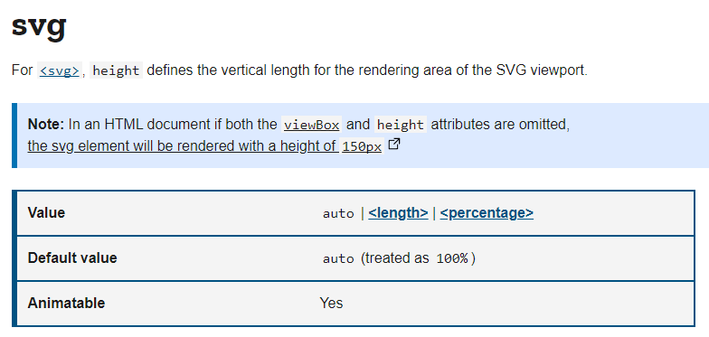
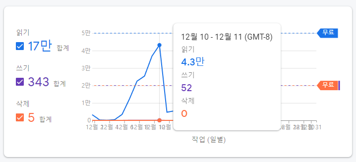

[Hongik Memories](https://hongikmemories.com/)는 이번에 홍익대학교 시각디자인과를 졸업하신 양해림님이 디자인하셨고, 2021년에 진행했던 졸업 전시회에 전시되었던 작품입니다. 저는 의뢰를 받아서 웹 사이트로 개발을 진행했으며, 이 글을 통해서 작품을 개발했던 과정을 되짚어보고자 합니다.

## 개발 전

처음에 개발을 의뢰받았을 때부터 와이어프레임과 필요한 기능 목록을 먼저 정리해서 보내주셨었습니다.

- 맵이 구글맵처럼 줌인/줌아웃/패닝이 가능
- 맵 위의 건물에 롤오버하면 색이 바뀌거나, 짧은 gif 애니메이션이 들어감
- 맵 위의 건물을 클릭하면 건물별 상세페이지 진입
- 상세페이지에 댓글 기능 (로그인 없이 글만 쌓이게, 수정/삭제정도)
- 건물과 각 상세페이지의 갯수는 22개

이외에 모바일을 포함한 반응형 웹 사이트로 개발을 원하셨고, 개발 기한은 3주 정도였습니다.

처음에는 거절하려고 했습니다. 지도 기능을 반응형으로 구현해야 했기에 개발 난이도가 어느 정도 있을 것이라 판단했기 때문입니다.

지도를 구현한다고 하면, 카카오맵 API의 [커스텀 타일셋 기능](https://apis.map.kakao.com/web/sample/customTileset/)을 활용하는 방법도 있었겠지만, 일반적인 지도와는 약간 성격이 달랐습니다. 이런 기능을 활용하려면 작업된 이미지를 여러 타일로 나누는 작업을 거쳐야 했을 뿐더러, 커서를 올렸을 때 다른 이미지로 대체해서 보여주는 인터랙션도 구현해야 했기 때문에 카카오맵 API를 그대로 활용할 수는 없었습니다.

게다가 한창 취업을 준비하고 있었기 때문에 부담감도 컸습니다.

하지만 [최근에 진행했던 프로젝트](https://zzimkkong.com/)에서 지도의 동작과 유사한 기능을 개발했었습니다. 바로 SVG 에디터였습니다.

<video autoplay loop>
  <source src="./zk_hm.mp4" type="video/mp4" />
</video>

영역을 마우스로 드래그해서 움직일 수 있으며, 확대/축소하는 기능까지 만들어두었던 상태였기 때문에, 관련 코드를 그대로 가져와서 활용할 수 있을 것으로 판단했습니다.

또한, 시행착오가 어느 정도 줄어든 상태에서 작업한다면 비교적 부담이 덜할 것으로 예상했기에 의뢰를 수락했습니다.

## Vite


바쁜 시기에 개발을 진행해야 했기 때문에, 많이 사용해보지 못했거나 익숙하지 않은 도구들은 사용하지 않기로 마음 먹었지만 행동은 정반대로 하더군요... 🥲

Create React App은 많이 써봤으니까 왠지 쓰고 싶지 않고, 그렇다고 Webpack과 같은 모듈 번들러로 일일이 환경을 구성하기는 번거로웠습니다. 그렇다면? 이번에는 Vite를 사용해보기로 했습니다.

다음의 명령어로 TypeScript를 이용하는 React 프로젝트를 생성할 수 있었습니다.

```bash
yarn create vite campus-memories --template react-ts
```

결론적으로 Vite는 괜찮은 선택이었습니다. 무엇보다 ESBuild를 이용하기 때문에, Webpack과는 비교도 할 수 없을 정도로 빠른 빌드 속도가 굉장히 만족스러웠습니다.

Static Assets은 어떻게 빌드에 포함해야 하는지, dotenv는 어떻게 설정해야 하는지는 Vite 문서를 참고하면서 개발할 수 있었습니다.

## Firebase


Hongik Memories는 Firebase로 인프라를 구성하여 개발했습니다. 덕분에 인프라에 대한 고민 없이 댓글을 저장하는 기능을 빠르게 구현할 수 있었습니다.

Firebase를 사용한 이유는 다음과 같습니다.

- DB나 배포 환경을 구성해야 하는 번거로운 문제에서 벗어나, 인프라 걱정 없이 개발할 수 있다.
- 심화 기능만 사용하지 않는다면, 낮은 러닝 커브로 서버와 통신하는 기능을 구현할 수 있다.
- 사용자가 적은 서비스에서는 무료로 운영할 수 있다. (이게 핵심입니다)

DB는 Cloud Firestore를 이용하였고, 댓글을 입력할 때 같이 입력하는 비밀번호를 암호화하는 Functions가 트리거되도록 개발했습니다.

아무래도 익명으로 댓글을 작성해야 하기 때문에, 삭제하거나 수정할 때 필요한 비밀번호를 추가로 입력받아야 했고, 자연스럽게 비밀번호를 암호화해야 한다는 문제가 있었습니다. Cloud Firestore의 데이터들은 자체적으로 모두 암호화되어서 저장되지만, Firebase 콘솔에서는 모든 데이터들을 열람할 수 있기 때문에, 비밀번호가 모두 노출된다는 문제가 있었습니다. 후환을 남기지 않기 위해서 🥲 Functions에 비밀번호를 암호화하는 로직을 추가로 작성하여 구성하였습니다.

배포는 Hosting 기능을 사용하였고, GitHub 저장소에 push하면 GitHub Actions에 의해 자동으로 배포되도록 구성했습니다.

## 지도 화면 이동 및 확대/축소 구현

<video autoplay loop>
  <source src="./hm1.mp4" type="video/mp4" />
</video>

지도 화면의 이동은 SVG 영역에 맞추어서 요소들의 좌표를 변경하면서 동작합니다.

해당 구현 로직은 최근에 만들었던 에디터 기능에서 화면을 이동하는 기능과 확대/축소하는 기능은 **별도의 커스텀 훅으로 분리**해두었던 상태였습니다. 덕분에 커스텀 훅만 그대로 가져와서 바로 구현할 수 있었습니다.

이전 프로젝트와는 다르게, 지도를 이동할 때마다 발생하는 이벤트 핸들러 함수에 지도의 위치가 이미지 영역을 벗어나지 않게 이동하도록 처리해야 했습니다.

이미지가 화면 영역을 벗어났는지 확인하기 위해서, 지도를 이동할 때마다 현재 이미지의 크기, 화면 크기, 그리고 현재 지도 영역의 위치값을 가지고 계산하도록 처리했습니다.

## 모바일 대응

추가로 지도가 모바일에서도 동작해야 했습니다.

지도 이동 로직은 `MouseEvent`에 적용되어 있었기 때문에, `TouchEvent`에 적용하여 동일하게 동작하도록 처리할 수 있었지만, 확대하고 축소할 수 있도록 핀치 줌을 따로 구현해야 했습니다.

자연스러운 핀치 줌 동작은 두 손가락으로 확대/축소하면서 지도의 이동까지 자연스럽게 이루어지지만, 이렇게까지 자연스러운 핀치 줌을 구현하기에는 시간이 오래 걸릴 것으로 판단했습니다.

그래서 우선 두 손가락으로 확대/축소만 가능하게끔 구현하기로 했습니다. 로직은 다음과 같습니다.

1. 처음으로 터치가 이루어진 좌표를 저장한다. 이 좌표가 확대/축소가 이루어지는 기준 좌표이다.
2. 화면에 닿고 있는 두 손가락의 거리가 늘어나면 확대, 줄어들면 축소한다.

확대/축소 또한 마우스 휠로 동작하도록 구현해두었던 커스텀 훅을 그대로 가져와서 활용했습니다.

이렇게 한 손가락으로 지도의 이동만 이루어지도록, 그리고 두 손가락으로 지도의 확대/축소만 이루어지도록 구현했습니다.

두 손가락의 거리에 비례하여 자연스럽게 확대/축소되도록 구현하고 싶었는데, 생각처럼 동작하지 않아서 시행착오를 많이 겪었습니다. 지금도 만족스러울 정도로 자연스럽게 동작하지는 않아서 많이 아쉬웠습니다.

## Mac 트랙패드 대응

요구사항 중에 Mac에서 동작하는 트랙패드에 대응해야 하는 문제가 있었습니다. 처음에는 `TouchEvent`로 대응할 수 있을 것이라고 생각하고 가능하다고 말씀드렸었는데, 알고 보니 Mac 트랙패드는 비표준 이벤트인 [`GestureEvent`](https://developer.mozilla.org/en-US/docs/Web/API/GestureEvent)를 바인딩해야 했습니다.

문제는 제가 Windows에서 개발하고 있었다는 것입니다. Safari 관련 문제는 아이패드로 어떻게든 확인할 수 있었지만 `GestureEvent`는 확인할 방법이 없었습니다.

이 부분은 어쩔 수 없이 양해를 구했고, 실제 전시에서는 마우스를 이용하도록 변경했습니다.

개발할 때는 어쩔 수 없이 맥북을 사용하는 수밖에 없는 걸까요? 😢

## `image-rendering` CSS 속성에 대한 고찰

래스터 이미지는 크기를 확대하거나 축소했을 때, 품질이 저하된다는 문제점을 가지고 있습니다. 이미지를 확대했을 때는 이미지의 픽셀 구성이 눈에 잘 보일 정도가 되고, 이미지를 축소했을 때는 선명해지다 못해 굉장히 날카롭게 보여집니다.

그래서 보통 소프트웨어들이 이미지를 보여줄 때는, 내부적으로 이미지가 부드럽게 보여지도록 처리하는 스케일링 알고리즘을 거쳐서 렌더링합니다.


웹 브라우저도 마찬가지인데, 이와 관련된 CSS 속성이 있습니다. 바로 `image-rendering`입니다.

`image-rendering`의 기본값은 `auto`로, 이미지를 어느 정도 부드럽게 보여주도록 처음부터 설정되어 있습니다. 그래서 웹 브라우저에서 이미지를 보여줄 때 렌더링 형식에 대해 크게 고민하지 않고 보여줄 수 있었던 것입니다.

Hongik Memories의 경우는 픽셀 아트 작품이었기 때문에, 지도를 확대했을 때 부드럽게 처리되어 렌더되는 것이 오히려 디자인 의도를 해친다는 문제가 있었습니다.

그래서 확대해도 픽셀의 느낌이 살아있도록 `image-rendering`에 `pixelated`라는 속성값을 적용했습니다. `pixelated`는 이미지가 확대되었을 때, 개별 픽셀이 눈에 보이도록 렌더하는 특징이 있습니다.

다만 `pixelated`를 적용한 상태에서 지도를 최소 크기로 축소하면, 오히려 날카롭게 보여지는 문제가 있었습니다. 그래서 지도가 최소 크기일 때는 `image-rendering: auto`가 적용되도록 구현했습니다.


[CSS-Tricks](https://css-tricks.com/almanac/properties/i/image-rendering/)나 [MDN 문서](https://developer.mozilla.org/ko/docs/Web/CSS/image-rendering)에서 `image-rendering` 속성에 대한 글을 읽어볼 수 있는데, 픽셀 아트의 의도에 맞는 속성은 `crisp-edges`라고 서술되어 있습니다. 하지만 디자이너분의 의도대로 이미지가 시각적으로 잘 보여져야 하기 때문에, 속성을 하나하나 변경하면서 디자이너분께 직접 확인받는 것이 가장 좋은 방법입니다.

다만 아쉽게도 실제 전시에 사용되었던 대형 화면에서는 의도와 다르게 이미지가 보여졌던 문제가 있었습니다. `auto`가 아니라 `crisp-edges`를 적용했으면 어떻게 보여졌을 지 시도해보지 못했던 아쉬움이 남습니다.

## SVG 관련 Safari 이슈

지도를 구현하면서 SVG와 관련된 Safari 이슈가 있었는데요. SVG 요소에 `height: 100%`를 적용했는데도 불구하고 세로로 영역을 차지하지 않는 문제가 있었습니다.

```html
<svg width="100%" height="100%"></svg>
```


Firefox와 Chrome은 괜찮았는데, Webkit을 사용하는 Safari만 제대로 적용되지 않았습니다. 이건 전에 개발했던 프로젝트에서도 동일하게 나타나는 현상이었습니다.

원인을 찾아보니, viewBox 속성을 지정해두지 않은 상태에서 height를 100%로 지정했던 것이 문제였습니다. viewBox 속성값을 입력해야 Safari에서 `height="100%"`가 의도대로 적용되더군요.

왜 이렇게 동작하는지, 해결 방법은 없는지 찾아봤지만 도저히 찾을 수 없었습니다. 그래서 우선 `window.innerHeight`를 이용하여 `resize` 이벤트가 발생할 때마다 height를 지정하도록 구현해둔 상태입니다. 이 회고를 작성하면서 원인을 찾아보기로 했습니다.

먼저 이와 관련된 Safari 이슈가 있었는지 검색해봤지만 찾을 수 없었고, 그 다음으로 명세를 찾아보았는데 [다음의 내용을 확인할 수 있었습니다.](https://www.w3.org/TR/SVG11/struct.html#SVGElementHeightAttribute)

> For outermost svg elements, the intrinsic height of the SVG document fragment. For embedded ‘svg’ elements, the height of the rectangular region into which the ‘svg’ element is placed.
> A negative value is an error (see Error processing). A value of zero disables rendering of the element.
> **If the attribute is not specified, the effect is as if a value of '100%' were specified.**

height는 지정되지 않으면 기본적으로 `height="100%"` 처럼 동작한다고 쓰여있었네요.

[MDN 문서](https://developer.mozilla.org/en-US/docs/Web/SVG/Attribute/height#svg)에서도 height의 기본값은 `auto`이지만 `100%`로 취급된다고 작성되어 있는 것을 확인할 수 있었습니다.



눈여겨볼 점은, `viewBox`와 `height`가 비어있다면, 150px로 렌더된다는 점도 Note에 함께 작성되어 있었다는 것입니다. 그래서 다시 SVG 명세를 찾아보았고, [다음의 내용을 찾을 수 있었습니다.](https://www.w3.org/TR/SVG11/coords.html#IntrinsicSizing)

> The intrinsic width and height of the viewport of SVG content must be determined from the ‘width’ and ‘height’ attributes. If either of these are not specified, a value of '100%' must be assumed.
> Note: the ‘width’ and ‘height’ attributes are not the same as the CSS width and height properties. **Specifically, percentage values do not provide an intrinsic width or height, and do not indicate a percentage of the containing block.**

1. SVG 요소의 `width`와 `height`는, CSS의 `width`와 `height`와 같지 않다.
2. 특히, 퍼센터지(%) 값은 `width`와 `height`의 고유값을 제공하지 않으며, 요소를 포함하고 있는 블록의 퍼센터지를 나타내지 않는다.

CSS의 경우, 외부 요소의 width와 height가 %여도 내부 요소의 width, height가 외부 요소에 상대적으로 %가 적용됩니다. 하지만 SVG의 %는 감싸고 있는 블록의 %를 가리키지 않는다고 작성되어 있습니다.

즉, `<svg>`를 감싸고 있는 HTML 요소의 `width`나 `height` 역시 고유한 값으로 지정되어 있어야 `<svg>`에 지정된 `width`나 `height`가 그 고유한 값을 따라갈 수 있다고 해석할 수 있겠네요.

```css
.campusMapContainer {
  flex: 1;
  height: 100%;
}
```

제 경우는 `<svg>` 를 감싸고 있는 모든 wrapper 요소에 `height: 100%`를 지정해둔 상태였습니다. 그래서 의도대로 동작하지 않았던 것으로 예상됩니다.

어떻게 보면 Safari가 표준을 잘 준수하고 있었다고 볼 수 있겠지만, 한편으로는 좀 더 좋은 방법은 없었을지 의문이 남네요.

## 마무리


어떤 프로젝트라도 완성하고 나면 뿌듯하지만, 이번 작업은 많은 분들이 코멘트를 남겨주고 가셨다는 점에 의미가 남달랐던 것 같습니다. 학교를 다니면서 있었던 일들도 새록새록 떠오르기도 했고요.



Firebase Console에서 볼 수 있는 서비스 사용량 그래프가 오르락내리락하는 것을 보는 재미도 있었습니다. Firestore에서 읽기 사용량이 4.3만건까지 올라가서 과금 직전까지 갔을 때는 깜짝 놀랐지만요. 😅

현업에서의 개발과는 다른 자극을 얻을 수 있다는 점에서 디자이너분들과 함께 작업하는 것은 제게 정말 뜻깊은 일입니다. 졸업 전시전에 가서도 다양한 아이디어를 보면서 인사이트를 얻을 수도 있고요. 앞으로도 이런 기회가 종종 있었으면 좋겠습니다.

## 관련 링크

- [Hongik Memories 관람하기](https://hongikmemories.com)
- [GitHub 저장소](https://github.com/Puterism/campus-memories)
