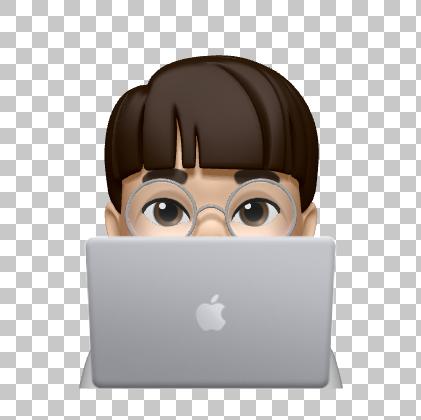
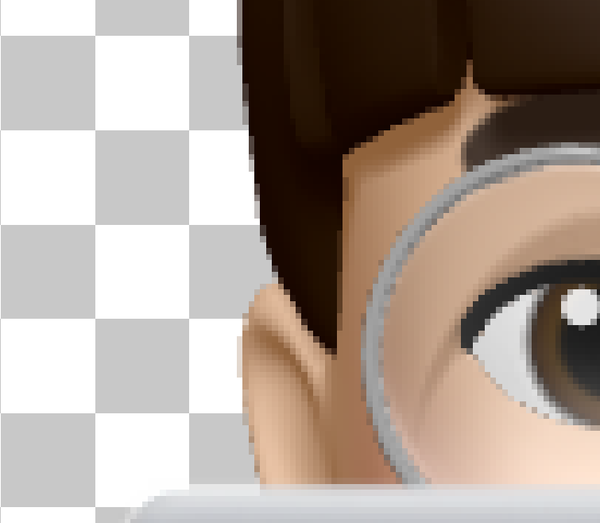
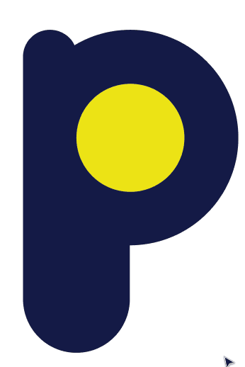
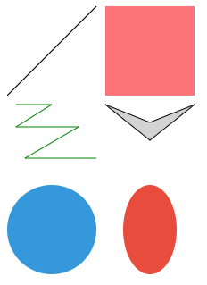

개발을 하다 보면 여러 가지 이미지 형식을 마주하게 된다. JPEG, PNG, GIF 등 다양한 형식이 있지만, 그 중 SVG라는 형식에 대해서 알아보고자 한다. 이미지 프로그램으로 열리지도 않고, 크롬과 같은 웹 브라우저로 열어야 보이는 SVG는 도대체 무엇일까?

SVG는 Scalable Vector Graphics의 줄임말로 '확장 가능한 **벡터** 그래픽'이라는 뜻이다. W3C에서 만든 벡터 이미지의 표준으로 XML 형식의 마크업 코드이다.

## 래스터 이미지가 아니라 벡터

일반적인 이미지는 래스터(Raster) 형식으로 되어 있는데, 각 픽셀에 색을 포함한 형태의 데이터가 저장된다. 그래서 이러한 형식들은 이미지의 해상도가 높으면 높을수록 화질이 좋아진다. JPG, TIFF, GIF, PNG, BMP 등이 래스터 형식을 따른다.

래스터 이미지는 비트맵(Bitmap) 형태의 데이터를 가지고 있어, 비트맵이라고도 한다.

래스터 형식의 이미지를 확대할 경우, 픽셀이 눈에 보일만큼 이미지 품질이 저하되어 보이게 된다. 또한, 축소를 하거나 회전 등의 이미지 변형 작업을 할 경우, 안티앨리어싱 과정이 반복되면서 품질 저하가 일어나게 때문에 원본을 완벽하게 유지할 수 없게 된다.

|
:-------------------------:|:-------------------------:
_래스터 이미지 예시_|_확대하면 이미지가 깨진다_

이와 다르게 벡터 형식은 점, 선, 면의 형태로 데이터가 저장된다. 점(Anchor)을 이용하면 직선과 곡선, 그리고 면까지 모두 만들어낼 수 있다. (일러스트레이터나 Figma와 같은 도구에서 펜 툴을 이용해본 경험이 있다면 더욱 공감할 수 있을 것이다.) 이러한 데이터를 가지고 위치나 형태를 수학적으로 계산하여 렌더하는 형식이다. SVG는 벡터 형식를 가진다.


그래서 벡터 형식인 SVG는 확대/축소하거나 변경해도 수학적으로 계산되기 때문에 흔히 말하는 "이미지 깨짐 현상"이 없으며, 수정도 훨씬 용이하다.

기업의 CI와 같은 로고 이미지를 찾을 때 일러스트레이터로 작업된 파일 형식(.ai)을 자주 볼 수 있는데, 이 또한 벡터 형식이다. 원본 변형을 일으키지 않고 용이하게 수정할 수 있다는 점, 그리고 벡터에서 래스터으로 변환하는 것은 쉽지만, 래스터은 벡터 형식으로 변환할 수 없다는 점도 고려되었을 것이다.



벡터 형식은 래스터 형식과 다르게 보여줄 때 데이터를 가지고 연산과 렌더 과정을 거쳐야 하지만, 래스터 형식은 이미 렌더가 되어있는 상태이기 때문에 그대로 보여주기만 하면 된다. 그래서 기기의 성능을 많이 요구하지 않은 덕분에 래스터 형식의 이미지가 그 동안 많이 사용되어 왔다. (IE 8 이전까지 SVG를 지원하지 않았던 것도 있지만...)

하지만 지금은 컴퓨터 성능이 많이 좋아져 렌더 과정에 큰 무리가 없으며, 텍스트 형태의 코드로 되어 있는 SVG가 래스터 형식의 이미지보다 훨씬 작은 파일 크기를 가진다는 장점이 있다. 추가로 애니메이션도 지원한다.

하지만 카메라로 찍은 사진과 같이 복잡한 형태의 이미지일 때, 벡터 형식이라면 연산 과정을 훨씬 더 복잡하며 시간도 오래 걸릴 수 있기 때문에, 이 때는 래스터 형식이 더 좋다.

특히 SVG는 웹 환경에 특화되어 있다고 볼 수 있다. 그 이유는 SVG가 XML 기반 마크업이기 때문이다. HTML 코드에 SVG 코드를 같이 작성할 수 있도록 브라우저가 지원해준다. 또한, CSS 스타일 시트를 적용할 수 있어 그래픽과 관련된 속성은 CSS로 분리할 수도 있으며, 자바스크립트를 통한 조작도 가능하다.

## SVG 코드로 그림 그리기

SVG에서 그릴 수 있는 도형 요소로는 `<circle>`, `<ellipse>`, `<line>`,  `<polygon>`, `<polyline>`, `<rect>`, `<path>`가 있다. (SVG 2에서는 `<mesh>` 라는 요소도 추가되었는데, SVG 2는 [명세](https://www.w3.org/TR/SVG2/)만 있을 뿐 아직 지원하는 브라우저가 없다.)

다음은 다양한 도형들을 그리는 코드이며, 아래의 이미지처럼 렌더된다.

```tsx
<svg version="1.1" xmlns="http://www.w3.org/2000/svg" width="300" height="300">
	<line x1="0" y1="100" x2="100" y2="0" stroke="black" />
	<rect x="110" y="0" width="100" height="100" fill="#ff7479" />
	<polyline points="10,10 50,10 10,35 80,35 20,70 100,70" stroke="green" fill="transparent" transform="translate(0,100)" />
	<polygon points="110,110 160,130 210,110 160,150" stroke="black" strokeWidth="10" fill="lightgray" />
  <circle cx="50" cy="250" r="50" fill="#3498db" />
  <ellipse cx="160" cy="250" rx="30" ry="50" fill="#e74c3c" />
</svg>
```



각 요소마다 도형을 나타내는 좌표 속성은 조금씩 다르지만, 스타일을 줄 수 있는 속성은 거의 동일하게 사용할 수 있다. 숫자로만 값을 넣을 경우 px 단위로 적용된다.

### 도형 요소 및 좌표 속성 정리

- `<line>`은 `x1`, `y1`로 시작점, `x2`, `y2`로 끝점을 지정하여 선을 그릴 수 있다.

    ```tsx
    <line x1="0" y1="100" x2="100" y2="0" stroke="black" />
    ```

- `<rect>`로 직사각형을 그릴 수 있다. `x`와 `y`로 왼쪽 위를 기준으로 좌표를 정하고, `width`와 `height`를 통해 크기를 정할 수 있다.

    ```tsx
    <rect x="110" y="0" width="100" height="100" fill="#ff7479" />
    ```

- `<polyline>`으로 다각선을, `<polygon>`으로 다각형을 그릴 수 있다. `points` 속성에서 `x,y` 좌표의 형식으로 선의 점(Anchor)들을 설정할 수 있다.
    - `<polyline>`과 달리 `<polygon>`은 마지막 point과 첫번째 point가 연결되는 선이 자동으로 이어진다.

    ```tsx
    <polyline points="10,10 50,10 10,35 80,35 20,70 100,70" stroke="green" fill="transparent" />
    <polygon points="110,110 160,130 210,110 160,150" stroke="black" strokeWidth="10" fill="lightgray" />
    ```

- `<circle>`으로 원을, `<ellipse>`으로 타원을 그릴 수 있다. `cx`와 `cy`로 원의 중심을 정할 수 있고, `r` 속성으로 반지름을 정할 수 있다.
    - `<ellipse>`의 경우, `rx`와 `ry` 속성으로 각각 가로, 세로의 반지름을 따로 설정해주어야 한다.

    ```tsx
    <circle cx="50" cy="250" r="50" fill="#3498db" />
    <ellipse cx="160" cy="250" rx="30" ry="50" fill="#e74c3c" />
    ```

### 예시 코드에서 사용한 스타일 속성 정리

- `stroke`: 선의 색상을 설정할 수 있다. 선 뿐만 아니라 각종 도형의 모서리 선 색상도 설정한다.
- `strokeWidth`: 선의 두께를 px 단위로 설정할 수 있다.
- `fill`: 면의 색상을 설정할 수 있다. 면의 색상이 설정되지 않았다면 `black`이 기본값(?)이다.
- `transform` : [CSS transform](https://developer.mozilla.org/ko/docs/Web/CSS/transform) 속성 그대로 요소를 변형하는 효과를 줄 수 있다.

이외의 다양한 속성을 통해 도형의 스타일을 바꿔줄 수 있다.

## SVG 뷰포트(viewport)와 뷰박스(viewBox)

SVG 이미지 크기를 조절할 때 알아야 하는 뷰박스와 뷰포트에 관한 글은 다음 링크에서 확인할 수 있다.

[SVG 뷰포트(viewport)와 뷰박스(viewBox)](/svg-viewport-and-viewbox)


## 부록: 리액트에서 사용하기

리액트에서 SVG를 사용하려면 `` 태그를 사용해도 되지만, SVG를 컴포넌트처럼 가져와서 사용할 수도 있다. Create React App으로 프로젝트를 생성했다면 다음과 같이 바로 사용할 수 있다.

```tsx
/* 1. EditIcon이라는 이름으로 import한다. */
import { ReactComponent as EditIcon } from './assets/edit.svg';

const App = () => {
	return (
		<div className="app">
		  {/* 2. 컴포넌트처럼 사용한다 */}
			<EditIcon />
		</div>
	);
};

export default App;
```

만약 모듈 번들러를 이용하여 직접 프로젝트를 세팅했다면, [SVGR](https://react-svgr.com/)을 설치하면 된다. (Create React App도 SVGR이 세팅되어 있기 때문에 바로 SVG 컴포넌트를 사용할 수 있다.) Webpack의 경우에는 `[@svgr/webpack](https://react-svgr.com/docs/webpack/)`을 설치해주면 된다.

## 부록 2: SVGR을 사용할 때의 주의점

SVGR은 SVG를 import할 때 포함되어 있는 `viewBox` 속성을 없애고 가져온다. `viewBox` 속성을 없애주는 옵션이 기본으로 활성화되어 있기 때문이다. 따라서, SVG를 리사이즈할 때 의도와 다르게 동작할 경우, `viewBox` 속성이 존재하는지 확인하면 좋다.

보통 SVG는 Figma나 일러스트레이터와 같이 드로잉 툴로 그리기 때문에, 자동으로 SVG 코드가 생성되는 형태이다. 이렇게 자동 생성되는 SVG 코드에는 보통 `viewBox` 속성이 포함되어 있다. 이 때  `viewBox`를 없애게 되면, 코드에서 SVG의 크기를 조절할 때 의도와 다르게 동작할 수 있다.

`viewBox` 속성을 그대로 사용하려면 `removeViewBox` 옵션을 `false`로 바꿔주어야 한다.

다음은 `.svgrrc.js` 파일에서의 적용 방법이다.

```jsx
module.exports = {
  svgoConfig: {
    plugins: {
      removeViewBox: false
    }
  }
};
```

만약 Webpack을 사용하고 있다면 `webpack.config.js` 파일에서 설정해주면 된다.

```jsx
{
  test: /(icons|images)\/.*?.svg$/,
  use: [{
    loader: '@svgr/webpack',
    options: {
      svgoConfig: {
        plugins: {
          removeViewBox: false
        }
      }
    }
  }, 'file-loader']
}
```
