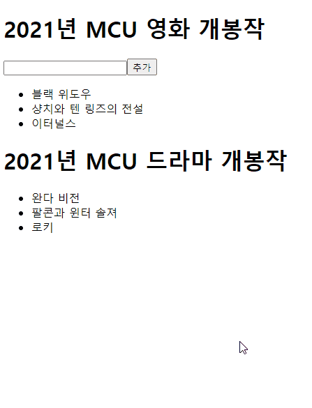
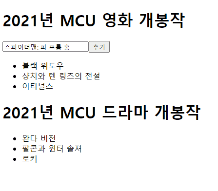
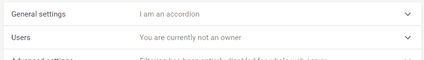

리액트에서의 Context는 특정 범위 내에 존재하는 각각의 컴포넌트에서 동일한 데이터에 접근할 수 있게 해주는 기능이다. 원하는 범위 안에서의 가장 최상위에 존재하는 컴포넌트를 Context Provider로 감싸면, 내부의 모든 컴포넌트들은 해당 Context의 Value에 접근할 수 있게 된다.

Context는 종종 Redux, MobX, Recoil 같은 전역 상태 관리 라이브러리와 비교되는데, 이러한 라이브러리와는 성격이 조금 다르다. [Context를 설명하는 리액트 공식 문서](https://ko.reactjs.org/docs/context.html)를 읽어보면 데이터를 제공한다고 쓰여있을 뿐, `상태`라는 키워드는 전혀 등장하지 않는다. 상태를 포함하여 상위 컴포넌트에 있는 데이터를 하위 컴포넌트에서도 접근할 수 있도록 해줄 뿐, Context에서 상태 그 자체를 관리하는 것은 아니다.

Context의 특징을 정리하면 다음과 같다.

## Context의 상태는 React의 상태이다.

Context를 통해 상태(State) 데이터를 제공하면, 상태와 관련 없는 컴포넌트의 렌더링이 불필요하게 일어날 수 있다. React는 상태가 변화했을 때 해당 상태가 정의된 컴포넌트가 다시 렌더링되기 때문이다.

Redux의 경우는 react-redux를 통해 변경된 Redux 상태와 관련 있는 컴포넌트만 다시 렌더링된다. 하지만 Context는 단순히 데이터만 전달해주는 역할을 할 뿐이다.

Context를 사용할 때는 value가 변화할 때마다 다시 렌더될 수 있어야 하는 부분에 사용하는 것이 좋겠다. 공식 문서에서는 `현재 로그인한 유저, 테마, 선호하는 언어`를 예시로 설명하고 있다.

## Context는 여러 개의 Context를 생성하고 관리할 수 있다.

Context를 여러 개 생성하여 원하는 범위끼리 각자의 데이터를 공유하도록 만들 수 있다.

## Consumer는 가장 가까운 Provider의 value를 참조한다.

동일한 Context의 Provider 안에 또 다른 Provider를 중첩할 수는 있으나, 가장 가까운 Provider의 value를 참조한다.

다음 코드에서는 `ExampleContext`의 Provider를 3번 중첩시키고, 각각 다른 값을 전달한 상태이다. 실행하면 `3`이 출력된다.

```jsx
import { createContext, useContext } from 'react';

const ExampleContext = createContext();

const Child = () => {
  return <ExampleContext.Consumer>{(value) => value.id}</ExampleContext.Consumer>;
};

const App = () => {
  return (
    <div className="App">
      <ExampleContext.Provider value={{ id: 1 }}>
        <ExampleContext.Provider value={{ id: 2 }}>
          <ExampleContext.Provider value={{ id: 3 }}>
            <Child />
          </ExampleContext.Provider>
        </ExampleContext.Provider>
      </ExampleContext.Provider>
    </div>
  );
};

export default App;
```

`Consumer`는 `useContext` hook으로 대체할 수 있다.

```jsx
import { useContext } from 'react';

const Child = () => {
  const context = useContext(ExampleContext);

  return <p>{context.id}</p>;
};
```

## Context의 활용

### 렌더링 최적화하기

Context를 활용하면 상태 변화 시 특정 컴포넌트에서만 렌더링이 발생하도록 최적화해줄 수 있다.

**상태가 변화하면 하위 컴포넌트들도 다시 렌더링된다**는 특징을 이용하면 된다.

다음은 예시 코드이다. [https://codesandbox.io/s/react-context-test-tvjzs?file=/src/App.js](https://codesandbox.io/s/react-context-test-tvjzs?file=/src/App.js)

```jsx
import { createContext, useContext } from 'react';

const MovieContext = createContext();

const MovieProvider = ({ children }) => {
  const [movies, setMovies] = useState(['블랙 위도우', '샹치와 텐 링즈의 전설', '이터널스']);
  const value = { movies, setMovies };

  return <MovieContext.Provider value={value}>{children}</MovieContext.Provider>;
};
```

먼저 위 코드와 같이 `Context`를 생성해주고, Provider를 감싸는 컴포넌트(Wrapper)를 만든다. 이 때, 상태에 관련된 데이터를 Provider의 `value` prop으로 넘겨준다. 이렇게 하면, 상태가 변화할 때마다 Provider의 children에 있는 컴포넌트들만 다시 렌더될 것이다.

```jsx
const MovieList = () => {
  const { movies } = useContext(MovieContext);

  return (
    <ul>
      {movies.map((movie) => (
        <li key={movie}>{movie}</li>
      ))}
    </ul>
  );
};

const MovieListForm = () => {
  const { setMovies } = useContext(MovieContext);
  const [inputValue, setInputValue] = useState('');

  const handleChange = (event) => setInputValue(event.target.value);

  const handleSubmit = (event) => {
    event.preventDefault();

    setMovies((prev) => [...prev, inputValue]);
    setInputValue('');
  };

  return (
    <form onSubmit={handleSubmit}>
      <h1>2021년 MCU 영화 개봉작</h1>
      <input type="text" value={inputValue} onChange={handleChange} />
      <button>추가</button>
    </form>
  );
};
```

다음으로, Context value를 사용하는 컴포넌트들을 만든다. 여기서는 영화 목록을 보여주는 컴포넌트와 영화를 입력받는 폼 컴포넌트를 만들었다.

```jsx
const App = () => {
  return (
    <div>
      <MovieProvider>
        <MovieListForm />
        <MovieList />
      </MovieProvider>
      <h1>2021년 MCU 드라마 개봉작</h1>
      <ul>
        <li>완다 비전</li>
        <li>팔콘과 윈터 솔져</li>
        <li>로키</li>
      </ul>
    </div>
  );
};
```

마지막으로 이를 사용하는 App 컴포넌트이다. 이 때, `MovieProvider`는 영화 관련 데이터들을 사용하는 컴포넌트들만 감싸준 상태이다.

React Devtools에서 렌더링이 일어날 때 표시해주는 옵션을 켜서 테스트해본 결과는 다음과 같다.



영화 제목을 입력할 때는 `MovieListForm` 컴포넌트의 `inputValue`가 변화함에 따라 폼에 있는 요소들만 렌더링이 발생한다.

영화 제목을 입력하고 Submit했을 때, `movie`라는 상태에서 변화가 발생한다. 이 때, `movie` State가 정의되었던 `MovieProvider` 내부 영역에서만 렌더링이 발생하는 것을 볼 수 있다.

만약 `movie` State를 사용하지 않는 다른 컴포넌트에까지 `MovieProvider`의 영역을 넓힌다면, 불필요한 렌더링이 계속될 것이다.



### Context Provider를 적재적소에 배치하기

개인적으로 Context의 사용이 가장 적절하다고 생각했던 예시는 Material-UI의 [Accordion 컴포넌트](https://github.com/mui-org/material-ui/blob/c7a37397e78abb754280552429b43e07af156122/packages/material-ui/src/Accordion/Accordion.js#L175)였다.

```jsx
<Accordion expanded={expanded === 'panel1'} onChange={handleChange('panel1')}>
  <AccordionSummary expandIcon={<ExpandMoreIcon />} aria-controls="panel1bh-content" id="panel1bh-header">
    <Typography className={classes.heading}>General settings</Typography>
    <Typography className={classes.secondaryHeading}>I am an accordion</Typography>
  </AccordionSummary>
  <AccordionDetails>
    <Typography>
      Nulla facilisi. Phasellus sollicitudin nulla et quam mattis feugiat. Aliquam eget maximus est, id dignissim quam.
    </Typography>
  </AccordionDetails>
</Accordion>
```



`AccordionSummary` 컴포넌트가 Accordion의 상단 헤더 영역이고, `AccordionDetails`이 콘텐츠 영역이다. 그리고 상위에서 Accordion 컴포넌트로 감싸주는 형태로 사용한다.

`AccordionSummary` 컴포넌트의 버튼을 눌러 토글하는 구조이다. Accordion 컴포넌트를 토글하는 함수, open 상태를 `AccordionSummary`와 `AccordionDetails`가 공유해야 하는 상황이다.

이 상황에 Material-UI에서는 Context를 이용하여 데이터를 공유했다. ([`AccordionContext` 코드 링크](https://github.com/mui-org/material-ui/blob/c7a37397e78abb754280552429b43e07af156122/packages/material-ui/src/Accordion/AccordionContext.js))

Accordion 컴포넌트에 필요한 데이터들은 `AccordionContext`를 통해 각 컴포넌트에서 가져와 사용하고 있었다.

개인적으로 가장 좋은 Context 사용 예시라고 생각한다. 꼭 전역 범위가 아니더라도, 다수의 Context를 만들어 각각 필요한 범위에만 Context Provider를 배치하고 사용하는 구조가 돋보이기 때문이다.

서비스를 만들면서 컴포넌트를 만들 때, 위 예시를 많이 [참고](https://github.com/woowacourse-teams/2021-zzimkkong/blob/c3856fa34c9b9bb5d9d8f67beab178ff83156e1f/frontend/src/components/Panel/Panel.tsx#L33)하여 개발할 수 있었다.
