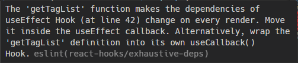

## `useMemo`에 대하여

리액트 공식 문서에 따르면, `useMemo`는 **메모이제이션**된 값을 반환한다고 한다.

## 메모이제이션 (Memoization)

메모이제이션은 중복되는 연산을 반복해야 하는 상황에서 사용할 수 있는 최적화 기법이다. 이전에 계산한 값을 메모리에 저장하고, 그 값을 반복되는 연산에서 사용함으로써 중복되는 계산을 줄일 수 있다. 알고리즘 공부를 할 때 배우는 동적 계획법(Dynamic Programming)이 이 메모이제이션을 활용한다.

피보나치 수열을 구하는 상황을 예시로 들어보자. 피보나치 수열을 재귀적으로 연산한다면 다음과 같이 코드를 쓸 수 있다.

```tsx
function fibo(n) {
  if (n === 0) return 0;
  if (n === 1) return 1;
    
  return fibo(n - 1) + fibo(n - 2);
}

console.log(fibo(5)); // 5

// fibo 함수 실행 횟수 : 15
```

이 과정에서, `fibo(5)`를 실행하여 `fibo` 함수가 호출된 횟수는 총 15번이다.

재귀적으로 함수가 호출되면서, `fibo(5)`의 결과값을 구하기 위해 `fibo(4)`과 `fibo(3)`이 호출되고, `fibo(4)`의 결과값을 구하기 위해 `fibo(3)`와 `fibo(2)`가 호출되고, `fibo(3)` 의 결과값을 구하기 위해 `fibo(2)`과 `fibo(1)`가 호출되고... 이런 복잡하고도 반복되는 연산이 계속 이루어진다.

잘 보면 이미 동일한 `n`으로 호출된 `fibo` 함수가 있는데, 재귀적으로 호출하다보니 똑같은 `fibo(n)`을 계속 실행하게 된다.

이런 식으로 똑같은 연산이 수행되지 않도록 메모이제이션을 적용할 수 있다. 이미 함수가 실행되어 연산된 값이 있다면 이를 재활용하여 연산할 수 있도록 하는 것이다. 다음 예시는 피보나치 수열을 연산하는데 DP를 적용한 코드이다.

```tsx
const dp = [0, 1];

const fibo = function (n) {
  /* 이미 연산된 값이 있다면, 이를 return 한다. */
  if (dp[n] || n <= 1) return dp[n]; 
  
  const result = fibo(n - 1) + fibo(n - 2);
  dp[n] = result;

  return result;
};

console.log(fibo(5)); // 5

// fibo 함수 실행 횟수 : 9
```

`dp` 배열에는 이미 연산된 값들이 들어있다. `dp` 배열에 `n` 에 해당하는 값이 들어있다면, 이를 바로 반환해주기만 하면 된다. 메모이제이션 적용 전에는 실행 횟수가 15번이었지만, 적용 후에는 9번만 실행되었다. 중복되는 연산이 정말정말 많을 경우에 메모이제이션을 적용하면, 비약적인 성능 개선을 기대할 수 있을 것이다.

다음은 JSBench.Me에서 성능을 비교해본 결과이다.

|이름|ops/s|비교|
|------|---|---|
|재귀|14478556.39 ops/s|91.08% 느림|
|DP|162243751.96 ops/s|가장 빠름|

## 다시 `useMemo`로 돌아오면

`useMemo`는 메모이제이션된 값을 반환한다. 직전에 연산된 **값**이 있다면, 그 값을 반환한다는 것이다.

`useMemo`는 다음과 같이 사용한다.

```tsx
useMemo(() => { /* 값을 연산하여 반환하는 로직 */ }, []);
```

첫번째 인자에는 값을 연산하여 반환하는 함수, 두번째 인자에는 어떤 값이 변경되었을 때 다시 연산해야할 지 알려주기 위한 배열을 넣어준다. 이를 dependencies array, 줄여서 deps라고 한다.

deps에 담겨져 있는 state나 prop의 값이 변경되었을 때, 첫번째 인자의 함수가 실행된다.

다음 예시 코드는 함수 컴포넌트를 사용하는 리액트 코드에서 computed value를 render하는 상황이다. 예시를 통해 `useMemo`는 어떻게 동작하는지 확인해보자.

```tsx
import { useMemo, useState } from "react";

export default function App() {
  const [value1, setValue1] = useState(0);
  const [value2, setValue2] = useState(0);

  const handleClick1 = () => {
    setValue1((prev) => prev + 1);
  };

  const handleClick2 = () => {
    setValue2((prev) => prev + 1);
  };

  const computedValue1 = value1 * value1;
  console.log('computedValue', computedValue);

  return (
    <div className="App">
      <p>{computedValue1}</p>
      <p>{value2}</p>
			<button type="button" onClick={handleClick1}>
        value1 +1
      </button>
      <button type="button" onClick={handleClick2}>
        value2 +1
      </button>
    </div>
  );
}
```

`value1`과 `value2`라는 두 가지 state가 있고, 각 state의 값을 1씩 증가시키는 버튼이 각각 하나씩 있다. 여기서 `value2`의 값을 1씩 증가시키는 버튼을 누르면 `value2`라는 state가 변화되었기 때문에, `value1`의 값이 바뀌지 않았더라도 리액트가 컴포넌트를 다시 render하기 위해 해당 함수(컴포넌트)를 처음부터 끝까지 다시 실행한다. 이후 return된 JSX element를 다시 render할 것이다.

즉, `state2`만 바뀌어도 `computedValue1`은 계속 연산된다.


`computedValue1`을 다음과 같이 `useMemo`를 사용한 코드로 변경해보았다. 

```tsx
const computedValue1 = useMemo(() => {
  console.log(value1 * value1);
  return value1 * value1;
}, [value1]);
```

연산한 값을 반환하고, deps에는 `value1`만 넣어주었다. 즉 `value1`이 바뀌었을 때만 함수를 실행한다는 뜻이다. 실행 결과는 다음과 같다.


`value2`가 아무리 바뀌어도 리액트가 컴포넌트를 다시 렌더하는 과정에서 `computedValue1`은 다시 연산되지 않고, `useMemo`가 메모이제이션된 값, 즉 이미 연산된 값을 반환해준다.

`useCallback`도 이와 비슷한데, `useMemo`가 **값**을 반환한다면, `useCallback`은 함수를 메모이제이션된 콜백 함수, 즉 이미 생성된 **함수**를 반환해준다. 컴포넌트가 다시 렌더될 때, `useCallback`의 deps에 있는 state나 prop의 값이 변경되지 않는 한, 해당 함수는 다시 생성되지 않는다.

## `useMemo`와 `useCallback`을 사용해야 하는 경우

그렇다고 무조건 `useMemo`와 `useCallback`을 사용한다고 해서 성능이 더 좋아지지는 않는다.

Kent C. Dodds는 이렇게 이야기한다.

> Performance optimizations are not free. They ALWAYS come with a cost but do NOT always come with a benefit to offset that cost.
Therefore, optimize responsibly.

최적화를 포함한 모든 연산에는 비용이 든다. 그러므로, 책임감 있게 최적화 코드를 작성해야 한다. 즉 `useMemo`나 `useCallback`을 사용하는 것 또한 비용이 발생한다는 것이다.

위 `useMemo` 예시 코드는 다음과 같이 분리해서 작성할 수 있다.

```tsx
const calcValue = () => {
  console.log(value1 * value1);
  return value1 * value1;
}

const computedMemoValue = useMemo(calcValue, [value1]);
```

컴포넌트가 다시 렌더될 때마다 함수를 생성하는 것은 똑같으며, `useMemo`라는 함수가 또 한 번 실행되고 있는 구조이다. 즉 `useMemo`라는 함수가 실행되는 것 또한 비용이다.

`useMemo`가 내부적으로 동작하는 코드를 찾아보았고, 아래는 그 코드이다.

```tsx
// https://github.com/facebook/react/blob/1a106bdc2abc7af190b791d13b2ead0c2c556f7a/packages/react-server/src/ReactFizzHooks.js#L342-L369

function useMemo<T>(nextCreate: () => T, deps: Array<mixed> | void | null): T {
  currentlyRenderingComponent = resolveCurrentlyRenderingComponent();
  workInProgressHook = createWorkInProgressHook();

  const nextDeps = deps === undefined ? null : deps;

  if (workInProgressHook !== null) {
    const prevState = workInProgressHook.memoizedState;
    if (prevState !== null) {
      if (nextDeps !== null) {
        const prevDeps = prevState[1];
        if (areHookInputsEqual(nextDeps, prevDeps)) {
          return prevState[0];
        }
      }
    }
  }

  if (__DEV__) {
    isInHookUserCodeInDev = true;
  }
  const nextValue = nextCreate();
  if (__DEV__) {
    isInHookUserCodeInDev = false;
  }
  workInProgressHook.memoizedState = [nextValue, nextDeps];
  return nextValue;
}
```

`memoizedState`가 존재하면서 `deps`에 있는 값에 변화가 없을 경우, 기존 값을 그대로 반환한다. 아니라면 `useMemo`에 들어온 함수를 실행하여 값을 연산하고 해당 값을 `memoizedState`에 저장한다.

덤으로 함수를 반환하는 `useCallback`의 코드는 다음과 같다. `useMemo`를 그대로 이용한다.

```tsx
// https://github.com/facebook/react/blob/1a106bdc2abc7af190b791d13b2ead0c2c556f7a/packages/react-server/src/ReactFizzHooks.js#L445-L450

export function useCallback<T>(
  callback: T,
  deps: Array<mixed> | void | null,
): T {
  return useMemo(() => callback, deps);
}
```

DP를 통해 피보나치 수열을 구하는 예시 코드에도 `dp` 배열에 값을 저장하는 비용, 그리고 `dp` 배열이 메모리에 차지하고 있는 비용이 추가적으로 발생한다. 하지만 DP를 적용함으로써 이러한 비용을 상쇄하고, 더 좋은 성능을 이끌어낼 수 있었다.

따라서 최적화를 위해서 `useMemo`와 `useCallback`을 사용할 때는 이들을 사용함으로써 비용을 줄일 수 있는 상황이어야 할 것이다.

`useMemo`의 경우는 **컴포넌트를 렌더할 때마다 값을 연산하기에는 큰 비용을 필요로 할 때**, `useCallback`의 경우는 **큰 비용을 필요로 하는 함수를 생성할 때** 필요한 값의 변경에 의해서만 실행될 수 있도록 사용해보면 좋을 것이다.

극단적인 예시로 눈에 보일 정도로 연산에 비용이 많이 드는 코드를 작성해서 다음과 같이 적용해보았다.

```tsx
const calcValue = () => {
  let value = value1;
  for (let i = 0; i < 10000; i++) {
    for (let j = 0; j < 10000; j++) {
      value = value + i + j;
    }
  }
  return value;
};

const computedMemoValue = useMemo(calcValue, [value1]);
```

|
:-------------------------:|:-------------------------:
_`useMemo` 를 적용하지 않았을 때_|_`useMemo` 를 적용했을 때_

연산에 필요없는 `value2`의 값만 변경되었을 때, 굳이 연산할 필요가 없으니 이 때 `useMemo`를 사용하면 성능 최적화를 이룰 수 있을 것이다.

그런데 이렇게까지 복잡한 연산을 하게 될 일이 있을까 싶다. 그래서 `useMemo`를 쓸 필요를 느끼지 못했다고 말하는 사람들이 많았나보다.

## 부록: `useEffect`에서 함수를 실행할 때, `useCallback`으로 감싸라는 경고가 뜨는 경우

가끔씩 `useEffect`에서 함수를 실행할 때, `useCallback`을 사용하라는 ESLint 경고를 종종 확인할 수 있다.



React에서는 Hook을 사용할 때, 자칫 잘못 사용될 경우를 대비하여 ESLint rules를 만들어두었는데, 이는 그 중 하나이다. 즉, 해당 함수는 매번 렌더될 때마다 생성되고 실행될 것이라고 알려준다. 이를 방지하기 위해서는 `useCallback`으로 감싸서 해당 함수의 deps를 지정해주어야 매번 실행되는 것을 방지할 수 있을 것이다. 꼭 성능 최적화를 위해서만 `useCallback`을 사용하는 것이 아니라, deps를 지정해주어야 하는 상황에서 `useCallback`을 사용할 수도 있을 것이다.